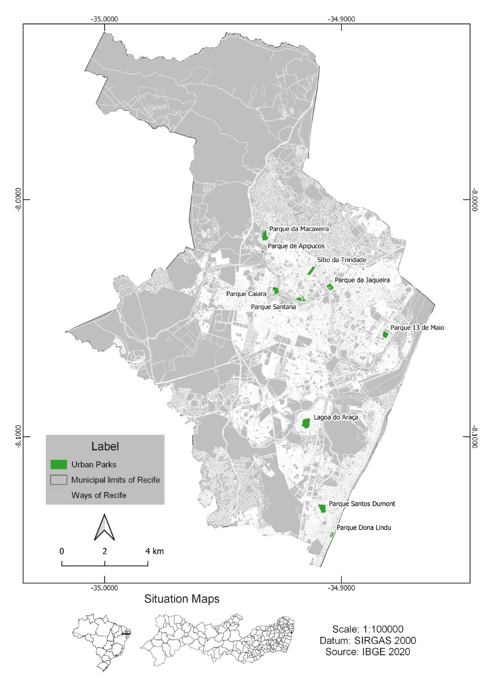

```{r setup, include=FALSE}
knitr::opts_chunk$set(echo = TRUE)
```

# Abstract {#abstract}

The growth of the urban population and climate change has led to an increasing need for urban green areas that provide ecosystem services in cities. This scenario is particularly true in developing countries that face rapidly growing populations and trade-offs between the growing demand to build infrastructure and access to nature. This article aims to analyze the importance of the urban park system in Recife (Brazil) to provide cultural ecosystem services. In addition, it aims to demonstrate the importance of accounting for these ecosystem services in urban management. To that end, a survey with 1144 users of the city's 10 official parks was conducted. Using the Contingent Valuation Method, we estimated the economic impact of parks on the population's well-being. We ascertained that the estimated WTP was between R\$ 32,69 and R\$ 40.47, representing an average of 1.0 and 1.3% of the interviewees' average income. The extrapolated values to potential park users have shown the significant economic impact of urban parks in Recife. In one year, it varies between R\$ 16.3 and R\$ 30.6 million and exceeds the current resources provided by the municipality for its management in a percentage between 20 and 57%. On the one hand, the data are highly significant because they demonstrate how the population perceives the importance of these areas. On the other hand, it shows that the positive impact on the provision of these ecosystem services is highly justifiable to local decision-makers to improve the well-being of urban populations.

*Key-words:* Cultural Ecosystem Services; Urban Parks; Green Areas; Economic Valuation Method.

# Introduction {#intro}

The world population is expected to increase 26% by the year 2050, from the current 7.7 billion to 9.7 billion [@un2019], which will lead to an even more significant increase of the population in urban areas, especially in regions like Latin America that already has around 81% of its population living in such areas [@un2018]. This scenario has increased the concern with maintaining and/or improving the welfare conditions for urban populations. Moreover, in this context, it is essential to consider that the well-being of the inhabitants of urban areas depends on an adequate supply of ecosystem services [@keeler2019social].

Nature's contributions to people, namely ecosystem services, are vital to human existence and contribute to a good quality of life. However, they are generally unevenly distributed in space, time, and among different segments of Society [@ipbes2019]. Concerning the well-being of urban populations, cultural ecosystem services are public goods produced by ecosystems that affect people's physical and mental states. Cultural services are characterized mainly as environments, places, or environmental situations that foster changes in people's physical or mental states [@haines2018revision]. Furthermore, in the context of greater urbanization, special attention must be paid to urban green spaces in order to offer this type of ecosystem service and to ensure the integration of these spaces in city planning [@haines2018revision].

Such a thing happens because the concept of ecosystem services can attract interests beyond the ones from academics and conservationists [@honeck2021integrating]. However, in general, its use is more conceptual than it is a strategic tool. Despite the potential to assist the understanding of specific trade-offs related to changes in land use and in integrating the concept into a multi-level planning [@liu2020supply].

Therefore, considering that municipalities should be increasingly aware of the countless benefits of urban parks, it seems evident that it is important to estimate them [@del2007estimating]. It is essential to evaluate these areas' impacts on monetary value and that the related spatial and environmental aspects receive adequate weight in the decision-making process [@verbivc2016contingent]. It is essential to do that because urban parks and other public goods depend on economic variables [@shimamoto2019empirical]. estimate these benefits that are materialized as public goods, it is necessary to use the contingent valuation method [@haab2002valuing].

However, there are some deficiencies about it. There are not many studies on the economic valuation of these areas, and many of them present poorly interpreted methodological aspects [@brandli2015estimating]. In the case of Brazil, most of these studies were carried out in the south, southeast, and midwest regions of the country and focused on individual parks[@castro2019; @neckel2020estimation]. Commonly, cultural ecosystem services are less assessed or assessed inappropriately [@ridding2018importance]. That is why they are not widely present in studies on this area [@boerema2017ecosystem]. Such scarcity makes it difficult to understand the potential benefit that urban green spaces can bring to the Brazilian population [@arana2017qualidade], and the importance of investments by the government in these areas. In general, local authorities do not consider these areas as essential contributors to economic development. There is a gap in perceptions about the economic benefits of urban green areas, and reducing that gap may have a significant positive impact on their financing [@nrpa2017]. The academic community urgently needs to provide explicit and pertinent information that meets the demands of decision-makers [@mandle2020increasing].

In this article, we aim to fill this information gap and demonstrate the importance of urban green areas as sources of provision of cultural ecosystem services in the city of Recife. For this study, we consider green areas as the set of urban parks in the city. As a way to better examine the topic, we do not focus on only one park, but all urban parks recognized by the city hall and the ones which have specific equipment for physical activities. As well as, we compare the valuation estimates of ecosystem services with the public expenditures of the city administration regarding urban parks. Among other contributions, the results demonstrate that the benefits in terms of cultural ecosystem services outweigh the city's investments for maintaining these areas. The estimated WTP fits into the national economic reality, demonstrating an understanding by the population of the extent of the contribution of these urban green areas to their well-being.

# Methodology {#sec:1}

## Study Area {#sec:2}

The place of study was the city of Recife, capital of the state of Pernambuco, in the Northeast region of Brazil. The municipality has 10 public parks spread over the 94 neighborhoods which compose it. The area which is covered by parks and squares is equivalent to 8.2% of the municipal territory. In these 10 areas there are structures known as gyms in the city, spaces with equipment for the practice of physical activities conducted by specialized professionals, in addition to other leisure equipment (Figure 1).

```{r figurename2, echo=FALSE, fig.cap= "Location of urban parks with city academies in the municipality of Recife - Pernambuco – Brazil", out.width = '70%', fig.align="center"}

```

## Survey methods and questionnaire design

The survey was conducted between September 2018 and March 2019 among the population living in Recife that use at least one of the 10 parks of the city. The survey method consisted of face-to-face personal interviews using a structured questionnaire and 1281 questionnaires were applied. According to the rules of resolution 510/1617 of the National Health Council [@brasil2016resoluccao], all procedures were in accordance with the resolution rules. The opinion survey format was prepared and not any kind of identification was requested. Moreover, In the approach to respondents on the park, the users were asked if they agreed to respond to the survey questions.

Data was gathered among Recife users' population, configuring a non-probabilistic sample with a convenience bias. There were no previous data on the number and characteristics of park users. The analyses and estimations were carried out through the R Studio 4.0 software. The dataset will be available in file CSV format at a Github repository.

The current survey was tested through a pilot study/previous survey in one of the city parks [@cruzneto2021]. The bid vector was constructed for the dichotomous choice questions based on the WTP responses in the previous survey. This study follows the questionnaire's structure based on the NOAA panel recommendations for CVM studies [@arrow1993report]. The questionnaire consisted of a set of 17 questions.

In the first part, we surveyed respondents' socioeconomic and household characteristics from people aged at least 18 years old. Then, in the second part, we asked about ways to use, access, and their perception of the physical characteristics of the parks (e.g. Facilities, maintenance, size, security), etc. In the third part, they were asked about their perception of ecosystem services in the park and their self-perception of physical and mental health. Finally, in the final part, we described the hypothetical scenario and the valuation questions. In this scenario, we presented a change in the park's vegetation cover. Such change was conceived to demonstrate to respondents the potential transformation in the area's environmental quality. It is essential to say the interviewer did a relevant visual presentation of the possible changes in the scenario presented (i.e. images before and after the park development). At last, they were asked how much they would be willing to pay (WTP) for the changes presented to them. A close-ended format in the WTP question was adopted to approximate real market transactions (i.e., take-it or leave-it decisions). Then, a double-bonded (DB) dichotomous choice format was applied [@arrow1993report; @hanemann1991statistical]. The procedures presented to respondents an initial bid value, randomly selected. If the response was "yes" a follow-up question with a higher bid was asked, while a "no" response led to a lower bid level.

The econometric models of dichotomous choice have been widely used to address contingent valuation Follows (Groothuis and Whitehead, 2002). The Random Utility Model provides the theoretical basis for the analysis of Contingent Valuation Methods. In this model, an individual could choose to pay a donation fee for the conservation of the services provided by the studied area if the following conditions are met (Hanemann, 1984):

```{=tex}
\begin{align}
u(y, X) = u(y-t, q, X)
\end{align}
```
```{=tex}
\begin{align}
u(y, X) = u(y_{j}X_{j}) + \epsilon_{0j})
\end{align}
```
```{=tex}
\begin{align}
v(1, y-t; X) + \epsilon_{1} \ge v(0, y, X)
\end{align}
```
While $u$ corresponds to the respondent's utility function, $v$ is the indirect utility function, $1$ represents the donation payment, and $0$ represents the non-payment, $y$ is the respondent's income, the amount of the bid made to the respondent, $X$ represents other socioeconomic characteristics that affect the respondent's preferences. The difference between the utility $\Delta v$ determines the payment of the donation or not:

```{=tex}
\begin{align}
\Delta v= (1, y-t;X) -v(0, y, X) + \epsilon_{1} + \epsilon_{0}  
\end{align}
```
The MVC dichotomous choice format requires a qualitative choice model. The use of a linear distribution of the WTP and a Bivariate Probit Model (BPM), was developed based on the model by [@cameron1994estimation]. It is assumed that the error of the second dichotomous question is correlated with the error of the first question. For this reason, we follow Alberini's [@alberini1995optimal] recommendation for the choice of bivariate dichotomous models, because if the coefficient correlation, $\rho \ne 1$, it is clear that, in general, the second WTP does not perfectly match the first and can be interpreted as a revised version of the amount of the first WTP. If WTP values are independently determined, then $\rho = 0$. For all other values of the correlation coefficient, the interval $0 < \rho < 1$ is valid, which implies that the correlation between the two WTP values is less than perfect.

The following formulation achieved the modeling of the data generated by the questions in the double limit dichotomous choice format:

$$
\begin{aligned}
\Delta Y_{i}(yes|no)= \alpha_{0} + \alpha_{1}Age + \alpha_{2}D_{1i} + \alpha_{3}D_{2i} \\ 
+ \alpha_{4}D_{3i} + \alpha_{5}D_{4i} + \alpha_{6}Tempo_{i} + \beta_{1}Bid_{12i} + \epsilon_{i}     
\end{aligned}
$$

$Y_i$ is the dependent variable and reports the respondent's answer ($yes = 1$ or $no = 0$) to the $Bid$, $Age_i$ is the age of the respondent, $D_{1i}$ is the dummy variable for the $Gender$ of the respondent (man = $1$, woman = $0$), $D_{2i}$ is a dummy for the respondent's education (complete higher education = $1$), $D_{3i}$ is a dummy for respondent assessing regarding the temperature in the park (good / excellent = $1$), $D_{4i}$ is a dummy for assessing the respondent regarding of the park's Facilities (good / great = $1$), $Bid_i$ are the variables for the values drawn as bids to respondents.

The $WTP_{ij}$ component represents the respondent's $j-th$ willingness to pay and $i = 1$, 2 denotes the first and second questions, respectively.

```{=tex}
\begin{align}
WTP_{ij} = X'_{ij}\beta_{i} + \epsilon_{ij}
\end{align}
```
The $WTP$ depends on a systematic component given by the observed characteristics of the interviewee $(X'_{ij}\beta_{i})$, as well as a random random component $(ij \sim N(0, \sigma^2))$.

```{=tex}
\begin{align}
Pr(yes, no) = Pr(WTP_{1j} \ge t^1, WTP_{2j} < t^2)
\end{align}
```
```{=tex}
\begin{align}
Pr(yes, no) = Pr(X'_{1}\beta_{1} + \epsilon_{1j} \ge t^1, X'_{2}\beta_{2} + \epsilon_{2j} < t^2)
\end{align}
```
Since the other sequence of possible responses can be constructed in an analogous way, which allows building the likelihood function:

$$
\begin{aligned}
L_{j} (\mu | t) = Pr(X'_{1}\beta_{1} + \epsilon_{1j} \ge t^1, X'_{2}\beta_{2} + \epsilon_{2j} < t^2)^{yn} * \\
Pr(X'_{1}\beta_{1} + \epsilon_{1j} < t^2 , X'_{2}\beta_{2} + \epsilon_{2j} \ge t^2)^{ny} * \\
Pr(X'_{1}\beta_{1} + \epsilon_{1j} > t^1, X'_{2}\beta_{2} + \epsilon_{2j} \ge t^2)^{yy} * \\ 
Pr(X'_{1}\beta_{1} + \epsilon_{1j} < t^1, X'_{2}\beta_{2} + \epsilon_{2j} < t^2)^{nn} 
\end{aligned}
$$

Given a sample of $n$ respondents, it was found that the function of logarithmic probability of the responses to the first and second moves of the dichotomous choice with double limit is:

$$
\begin{aligned}
Ln(L_{j} (\mu | t)) = yn \ln((X'_{1}\beta_{1} + \epsilon_{1j} \ge t^1, X'_{2}\beta_{2} + \epsilon_{2j} < t^2) * \\
ny Pr(X'_{1}\beta_{1} + \epsilon_{1j} < t^2 , X'_{2}\beta_{2} + \epsilon_{2j} \ge t^2) * \\
yy Pr(X'_{1}\beta_{1} + \epsilon_{1j} > t^1, X'_{2}\beta_{2} + \epsilon_{2j} \ge t^2) * \\
nn Pr(X'_{1}\beta_{1} + \epsilon_{1j} < t^1, X'_{2}\beta_{2} + \epsilon_{2j} < t^2)) 
\end{aligned}
$$

Once the regression is estimated, the estimated WTP is calculated as:

```{=tex}
\begin{align}
\widehat{WTP} = \frac{\hat{\alpha}\overline{X_{i}}}{\hat{\beta}} 
\end{align}
```
After estimating the individual WTP, the consumer surplus was calculated, considering two scenarios for the beneficiaries of Recife's urban parks. The scenarios were built according to the resident population in the minimum and maximum distance recommended for different types of urban parks: a) Population served within a radius of 800m from the parks; b) Population served within a 4800m radius from the parks [@meneses2018desafios; @mertes1996park].

## Integrating ecosystem services into policymaking

Integrating ecosystem services with planning and decision-making requires demonstrating the value of these assets [@jones2009valuing; @sukhdev2014economics]. Considering this, the second step of this stage was to analyze Recife's public expenditure once public budgeting is one of the first steps for planning public actions [@howard2001public]. Moreover, public expenditure review studies can play an essential role in environmental challenges [@gupta1995public; @swanson2003public], even when there is a focus on analyzing funding for biodiversity conservation, even at the local level [@nair2019biofin; @undp2018]. For that reason, we decided to process data extraction from the transparency portal website from the city of Recife regarding the last 8 years (2013- 2020), equivalent to two municipal management periods. Then, the expenses incurred by the different municipal bodies that were explicitly related to urban parks were analyzed.

# Results {#sec:3}

After processing the data, there were 1144 questionnaires validated. Considering the estimated population of 1,653,461 inhabitants of the city [@ibge2019] and the distribution between age groups, income, gender, and residence, the data represent the city. In the first part of the questionnaire, on socioeconomic aspects, it was possible to observe that 51.68% of respondents were female and 48.32% male. The vast majority of respondents, 92.82%, consisted of young adults (\< 65 years), the average age was 41.3 years old. The average monthly income was R\$ 3,091.00, and only 25.9% of the interviewees held at least a college degree. Among the variables related to the characteristics of the parks that were significant, the perception of infrastructure considered excellent or good were the ones that predominated. The temperature was considered predominantly between very bad and regular by the respondents. We collected responses from people living in all 94 neighborhoods in the city (Table 1).

```{=tex}
\begin{table}[!tbp]
\caption{Summary of Descriptive Statistics}
\label{tab1}
    \begin{center}
    \begin{tabular}{lcccccc}
    \hline\hline
    \multicolumn{1}{l}{}&\multicolumn{1}{r}{Min}&\multicolumn{1}{r}{1st. Quad.}&\multicolumn{1}{r}{Median}&\multicolumn{1}{r}{Mean}&\multicolumn{1}{r}{3st. Quad.}&\multicolumn{1}{r}{Max}\tabularnewline
    \hline
    Age & 18 & 30  & 39 & 41.25 & 51 & 96  \tabularnewline
    Gender & 0 & 0 & 1 & 0.542 & 1 & 1  \tabularnewline
    Education (years) & 0 & 0 & 0 & 0.2592 & 1 & 1 \tabularnewline
    Income & 41 & 998 & 1800 & 3087 & 4000 & 62000 \tabularnewline
    Facilities  &  &   &  &  &  &   \tabularnewline
   (great/good = 1, fair/bad/very bad = 0) & 0 & 0 & 0.5 & 0.5 & 1 & 1  \tabularnewline
    Temperature  &  & &  &  &  &  \tabularnewline
    (great/good = 1, fair/bad/very bad = 0) & 0 & 0 & 0.5 & 0.5 & 1 & 1 \tabularnewline
    Fist Bid &  1 & 14.25 & 28 & 29.06 & 44 & 70 \tabularnewline
    Second Bid & 1 & 16.25 & 32 & 33.68 & 50 & 75 \tabularnewline
   \hline
   \end{tabular} \end{center}
       \end{table}
```
It was also observed that 51.68% of the interviewees were people with some sort of occupation (10.53% civil servants; 27.90% private-sector employees and 13.25% self-employed), 2.71% unemployed, 5, 21% students, 21.82% retired, 18.57% did not fall into these categories. In addition, 41.98% of the interviewees declared themselves single, 42.31% married, and 15.7% are divorced, widowed or not declared. Of which, 41.52% had no children while 58.48% did have (25% = 1 child; 21.85% = 2 children; 11.63% = 3 or more children).

The second part of the questionnaire addressed the forms of the park usage by the interviewees. It seems that most users travel more than 4500m to access the parks and they have as their primary objective the realization of physical activities with a predominant duration between 30 and 60 minutes coinciding with the total time spent in the parks. The most-reported frequency of visitation was between 2 and 6 times per month.

The results from the BP regression for the general sample are shown in Table 2. The estimations for Eq. (1) are shown in the upper part of the Table, while the estimation for Eq. (2) in the lower part. The probability that WTP is equal or higher to the two bids amount is influenced by the respondent's own characteristics and by a series of independent variables that reflect their preferences for the ES being valued. The coefficient on the bid was negative and statistically significant in both equations, which indicates that as the price increased, the probability of a positive answer to the WTP question decreased.

The results for the general sample indicate that WTP from the first equation (Eq 1) was influenced positively by the level of education (0.2166, p-value \< 0,05), and by the respondent's perceptions about Facilities (0.5036, p-value \< 0,01) and temperature of the park (0.2702, p-value \< 0,01), while the respondent's gender was statistically significant just in the second equation.

These results allow us to highlight the finding that the respondents' age has a statistically significant negative impact on both the respondents' initial and follow-up decisions on their contribution to the accomplishment of the presented scenario. The regression coefficient is (-0.0066, p-value \< 0,05) at the respondents' initial response and (-0.0108, p-value \< 0,01) at the follow-up response, which means that the higher the age, the lowest the probability that the respondent will accept the proposed willingness-to-pay a fee.

```{=tex}
\begin{table}[!tbp]
\caption{Willingness to pay for Park visitors} \label{tab2}
    \begin{center}
    \begin{tabular}{lrrrr}
    \hline\hline
    \multicolumn{1}{l}{}&\multicolumn{1}{r}{Estimate}&\multicolumn{1}{r}{Std. Error}&\multicolumn{1}{r}{z-value}&\multicolumn{1}{r}{p-value}\tabularnewline
    \hline
       \vspace{5mm}
   \textbf{Equation 1} \
    \textit{Intercept} & $0.635419$ & $0.1440$ & $4.410$ & $0.00001$ \tabularnewline
    Bid1 & $-0.020311$ & $0.0020$ & $-10.154$ & $0.00000$ \tabularnewline
    Age& $-0.006643$ & $0.0026$ & $-2.540$ & $0.01109$ \tabularnewline
    Gender & $0.073047$ & $0.0776$ & $0.941$ & $0.34666$ \tabularnewline
    School & $0.216602$ & $0.0915$ & $2.367$ & $0.01795$ \tabularnewline
    Temperature & $0.270258$ & $0.0863$ & $3.131$ & $0.00174$ \tabularnewline
    Facilities & $0.503613$ & $0.0808$ & $6.226$ & $0.00000$ \tabularnewline
    \hline
\vspace{5mm}
   \textbf{Equation 2} \
     \textit{Intercept} & $ 0.528728$ & $0.1418$ & $3.728$ & $0.00019$\tabularnewline
    Bid2 & $-0.015654$ & $0.0019$ & $-7.832$ & $0.00000$\tabularnewline
    Age & $-0.010806$ & $0.0.0025$ & $-4.272$ & $0.00001$\tabularnewline
    Gender & $0.172253$ & $0.0740$ & $2.37$ & $0.019989$\tabularnewline
    School & $-0.067069$ & $0.0869$ & $-0.771$ & $0.44074$\tabularnewline
    Temperature & $-0.025151$ & $0.0832$ & $-0.302$ & $0.76265$\tabularnewline
    Facilities & $0.651171$ & $0.0770$ & $8.452$ & $0.00000$\tabularnewline
   \hline
   Nº Observations & & & &  $1144$ \tabularnewline
   Log Likelihood & & & & $-1342.32$ \tabularnewline
   AIC & & & & $2714.6$ \tabularnewline
   BIC & & & & $2790.3$ \tabularnewline
   \hline
   \end{tabular} \end{center}
       \end{table}
```
Examining only the second equation, the results for the general sample indicate that WTP is negatively influenced by the age of respondents (0.010, p-value \< 0,01), by the park's temperature (0.090, p-value \< 0,01), and the respondent's gender (0.042, p-value \< 0,186). However, it is positively affected by respondent's perceptions about the park's Facilities (0.176, p-value \< 0,01). Opposite to the first equation, the level of education was not statistically significant.

Furthermore, the results allow us to interpret some of the signs of the estimated coefficients as expected and consistent with the economic theory. For example, the likelihood of voting "yes" to the proposed program in the second equation is higher for younger and better-educated respondents, as well as for female respondents. It is not definite, but the age results can be determined by the respondents' older average age (41 years). On the other hand, it was checked that the likelihood of voting "yes" to the proposed program is lower when the park respondent's temperature perceptions are taken into consideration. Furthermore, the regression model indicates statistically significant and theoretically justify relationships between the WTP responses and several explanatory variables.

This result of WTP significance allowed an estimate of the aggregate monetary dimension of the benefits generated by urban parks in Recife in terms of cultural ecosystem services. For this calculation, it is possible to ponder that the data of population served in two scenarios: a) considering a walking distance range of 800m = 499.588 people; b) considering a walking distance range of 4,800m = 756.667 people [@meneses2018desafios; @mertes1996park]. Based on these two scenarios, we estimate the annual added value of cultural ecosystem services provided by urban parks in the city of Recife, which may vary between R\$ 16.3 and R\$ 30.6 million (Table 3).

```{=tex}
\begin{table}[!htbp]
\caption{Individual and aggregated WTP estimates considering two scenarios}
\label{tab3}
    \begin{center}
    \begin{tabular}{llll}
    \hline\hline
    \multicolumn{1}{l}{Model}&\multicolumn{1}{r}{Individual}&\multicolumn{1}{r}{Aggregate 1}&\multicolumn{1}{r}{Aggregate 2}\tabularnewline
    \hline
    Single-bounded & R\$ 40.47 & R\$ 20,218,328.00  & R\$ 30,622,315.00 \tabularnewline
    Double-bounded & R\$ 32.69 & R\$ 16,331,533.00 & R\$ 24,735,445.00 \tabularnewline
   \hline
   \end{tabular} \end{center}
       \end{table}
```
In order to contribute to the city's urban planning, public expenditures made by the city to maintain urban parks in the period from 2013 to 2020 were analysed. The data shows that the city has spent around R\$ 104 million in the past 8 years, equivalent to the last two administrative periods of urban management. The annual average expenditure for implementation and maintenance in the parks was of R\$ 13 million (Figure 2).

Based on these data, it is possible to observe that the city has made considerable investments to the expansion and maintenance of urban parks in Recife. In a context on which public expenditures have increased considerably due to the COVID-19 Pandemic, it is essential to note that investments in the provision of environmental public goods have been maintained. It is even more important to consider that the estimated economic return generated by these areas in terms of well-being exceeds the efforts made to maintain them. Hence, in this study, our estimates considered only the cultural ecosystem services associated with leisure. However, we recognize that these urban green spaces still provide a series of other ecosystem services, such as reducing heat islands and flood risks that undoubtedly increase their benefit/cost ratio.

```{r figurename, echo=FALSE, fig.cap= "Variation in expenses with the implementation and maintenance of Urban Parks in the municipality of Recife - Source: prepared by the authors based on data from the Transparency Portal of the City of Recife" , out.width = '70%', fig.align="center"}
knitr::include_graphics("figuregastos.PNG")

```

# Discussion {#sec:4}

Urban parks are privileged public spaces for providing a range of ecosystem services and promoting a sense of community among their visitors [@marselle2019biodiversity]. Several factors lead people to visit urban parks. In this study, the primary purpose of the reported visit was to perform physical activity (36.96%). Our findings corroborate other studies in which there is a predominance of physical and contemplative activities of nature by visitors. However, the correlation between these variables and WTP for the conservation or environmental improvement of the parks has still been proved inconclusive [@schipperijn2013associations]. The data obtained are well aligned with the reality of the city of Recife, which has a busy population of 43.1% with an average salary of around 3 minimum wages = R \$ 3,135.00. The age distribution is concentrated between 5 to 44 year-old age groups with a predominance of women [@ibge2019]. Regarding the distance traveled to get to the visited park, the highest frequency is from those who live within more than 4500m of distance (31.49%) and those who live between 100 and 500m of distance (27.90%). The distance and access to the parks is a factor that affects the perception of the population and WTP by these spaces [@latinopoulos2016valuing; @sabyrbekov2020nature]. The maximum reach of the population benefiting from a park would be from the ones who live within 4800m of distance [@mertes1996park; @meneses2018desafios], which demonstrates the poor distribution of these spaces in Recife, with a concentration of parks in some regions of the city.

The other characteristics of the use of parks in the city of Recife, is related to time spent in the park. The ones who spend up to 1 hour (43.21%) and up to 2 hours (34.09%). In addition, regarding the time spent on physical activity, the ones who spend up to 30 minutes (50.92%) and up to 60 minutes (24.54%) are convergent with studies carried out in developed countries(Keeler et al., 2019; Lai, Flies, Weinstein, & Woodward, 2019) and developing countries [@amato2016metropoles; @camargo2018physical; @londe2014influencia; @silveira2018espaccos]. It is noteworthy that some characteristics studied that have positive impacts on the health and well-being of populations are amplified for being carried out in green spaces.

Specifically, in relation to the results of the estimated model, the relationship between WTP and the variables bid 1 and 2, age, gender, education, infrastructure and temperature, were statistically significant. In the case of the parks in the city of Recife, the youngest and best-educated respondents tend to have a greater willingness to pay for improvement programs in urban parks, as already noted in other evaluations in other cities and countries [@del2007estimating; @latinopoulos2016valuing; @xu2020uncovering]. This situation may be related to a better understanding of the benefits offered by urban parks and the possibility of using them for more purposes depending on age. In addition, cultural aspects that differentiate cities can influence the factors that determine the use of urban parks and consequently their WTP [@wan2015salient].

It was also perceived that higher initial bids have a negative correlation with WTP [@del2007estimating; @latinopoulos2016valuing]. That aspect leads us to highlight the importance of the DB model to allow the respondent to review their intention to participate in the program and evaluate the dimension of their WTP [@aizaki2014stated]. This is also the justification for the fact that DB WTP estimates are lower than SB WTP estimates.

Regarding the characteristics of the parks that affect the WTP, it is worth mentioning that half of the city parks evaluated, were created in a period of 5 to 10 years. Many of them do not have their infrastructure yet completed , as shown in the plans of the city hall. Some of them lack certain items of infrastructure and so as a little afforestation. Infrastructure elements such as accessibility and size associated with their location affect usability and the perceived benefits generated by urban parks [@shimamoto2019empirical]. Many of these elements related to the infrastructure offered are associated with the primary intentions of when the parks were first created [@gong2015satisfaction]. Other elements are related to the lack of implementation or maintenance of the parks by the government. Especially in a city like Recife, those factors that interfere with the perception of the place's temperature affect the benefits and the park's usability.

For this reason, to determine the value of the WTP, we present potential scenarios with the improvement of these conditions. Thus, we find values between R\$ 40.47 and R\$ 32.69 aligned with the average WTP values for urban parks from other studies in Brazil R\$ 40.68 [@brandli2015estimating]; R\$ 30.68 [@neckel2020estimation]. The values estimated here represent around 1.3 and 1.0% of the interviewees' average income. This proportion of the fee that one is willing to pay for the city's parks seems to be in line with the predominant characteristics of the park's user population, especially in terms of income and education and the fact that the city has other outdoor leisure options, such as squares and beaches.

The knowledge of these values is vital for decision-makers, once it is necessary to be aware of the benefit generated by public expenditures, especially those destined to provide public goods. The volume of these public goods, such as urban parks, tends to be determined by supply and demand factors, and by examining the point at which the marginal cost on the supply side coincides with the marginal benefit on the demand side so that the maximum net benefits the society. Thus, in the case of investments in disadvantaged areas, it is essential to quantify the benefits generated, such as urban parks, which may not be a priority for the public authorities. [@shimamoto2019empirical].

It is necessary to highlight this topic because the parks and recreation departments currently face significant funding pressures once their budgets are more impacted than other areas of action by local governments [@nrpa2018]. Public authorities see parks and recreation boards as providers of essential solutions to many of their main concerns, including preventing youth crime and improving the quality of life. At the same time, however, while agreeing that parks are worth the capital spent on them, they admit that no other service provided by the local government has a greater funding impact when the local government needs to cut spending [@nrpa2017].

The benefits estimated by city parks exceed between 20 and 43% of the average annual expenses of the city with their maintenance. Moreover, considering that the estimated value refers only to cultural ecosystem services, other benefits are provided by these areas that were not accounted for in this study.

# Conclusion {#sec:5}

Given the importance of urban green spaces in the context of accelerated urbanization, this study was one of the first ones to investigate the benefits of an entire urban park system in a city. Our main results show that the benefits generated by the urban parks located in the city of Recife, in terms of cultural ecosystem services, outweigh the public expenditures of the city with the maintenance of these areas. Thus, the government should highlight the value of ecosystem services and their incorporation into urban planning.

Our results seem to ratify some of the already highlighted relations between socioeconomic variables and physical characteristics of urban green spaces with the approval of a fee as a means to improve the environmental quality. It was highlighted that age was a factor that contributed to a lower willingness to pay the bid; while gender, education, temperature, and infrastructure accounted for a higher WTP. What seems to demonstrate that the perception of the benefits of these areas is associated with a better prior understanding of the importance of these areas and the local characteristics once that in a tropical climate city, the thermal sensation was one of the outstanding characteristics.

Furthermore, the significance of variables such as temperature and infrastructure for WTP underscores the importance of adequate afforestation of these spaces for their proper use. The maintenance of these areas is necessary and requires investments by the government.

Other significant findings of our study are related to the distance traveled by park users. Evidencing that most users are divided into two groups: 1 - those who live within a short distance from these areas; 2 - And the largest group of those who live at a greater distance than that observed in international literature. This result highlights the observed reality of a concentrated and unequal distribution of green spaces in the city.

Our research further suggests that the proper use of economic valuation methods is an essential tool to demonstrate the role of conservation of ecosystem services in decision-making for local governments. Beyond this, we recommend the research team to put a greater effort on selecting a proper payment vehicle. It may achieve a greater reliability amongst the population on public intervention of urban green areas, therefore raising the ratio of yes responses to the survey and the social benefits aggregated from the parks.

# References
